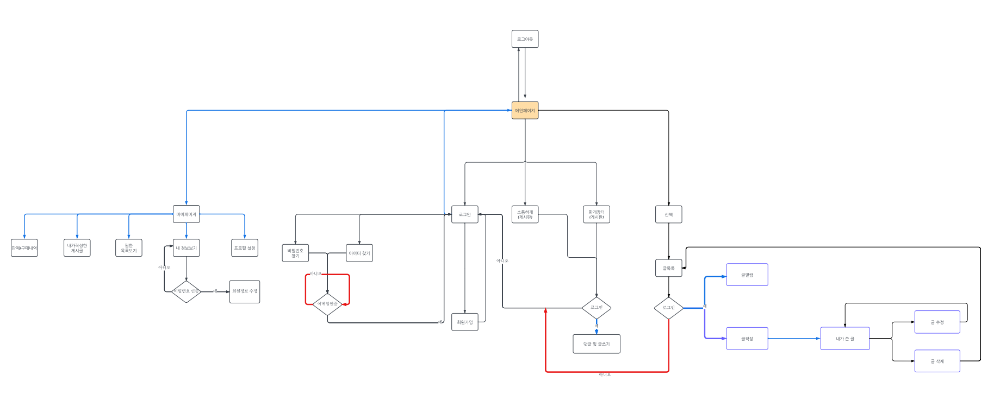
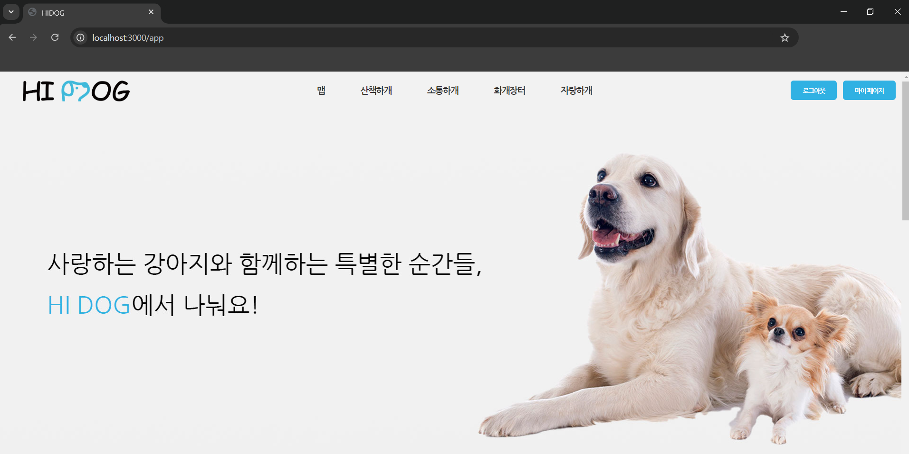
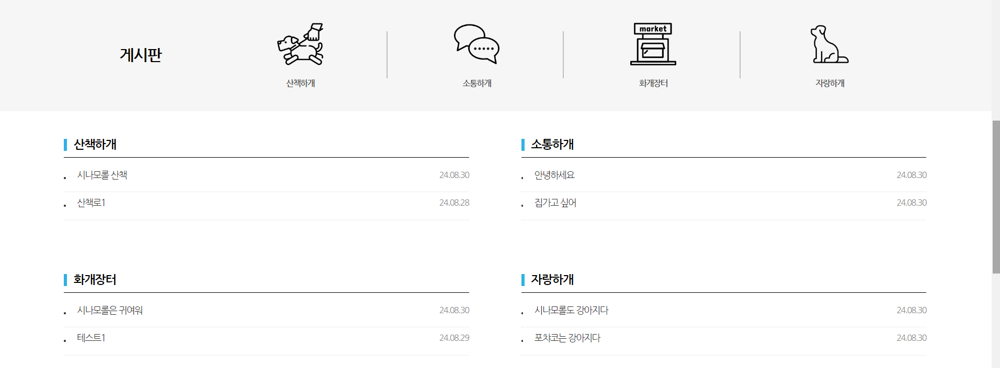
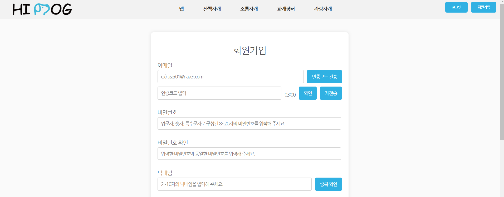
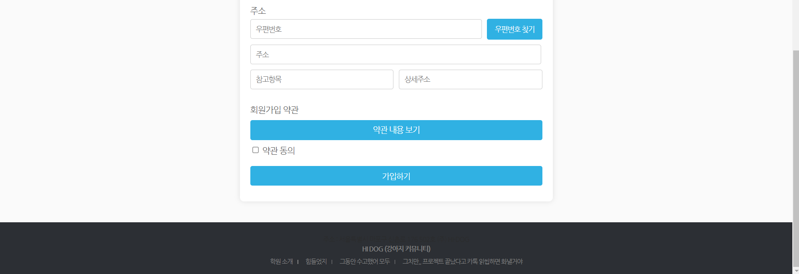
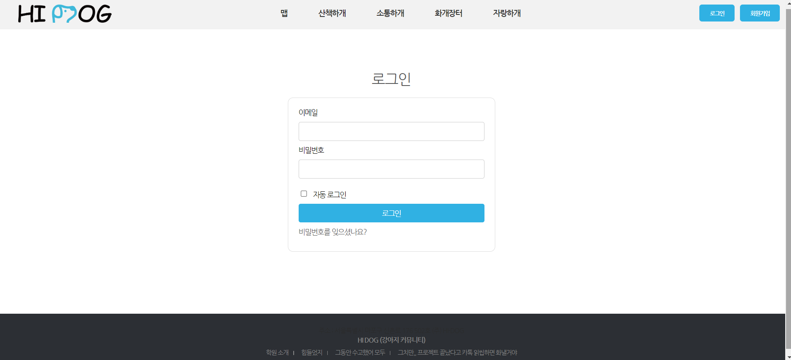
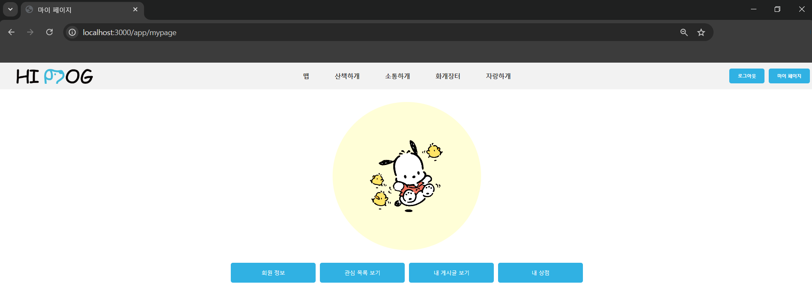
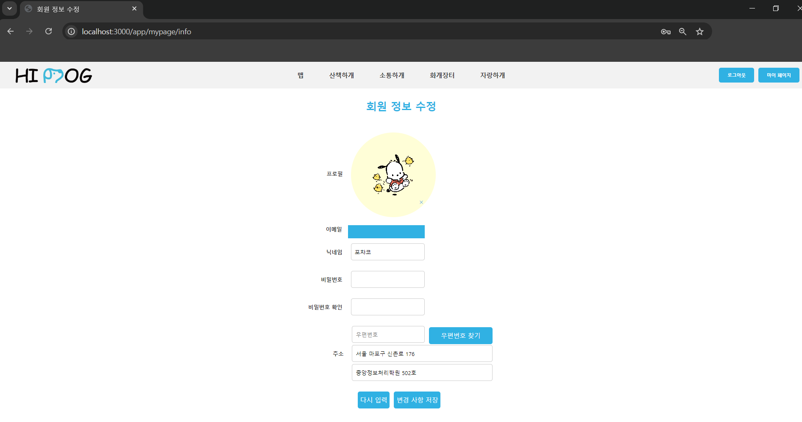
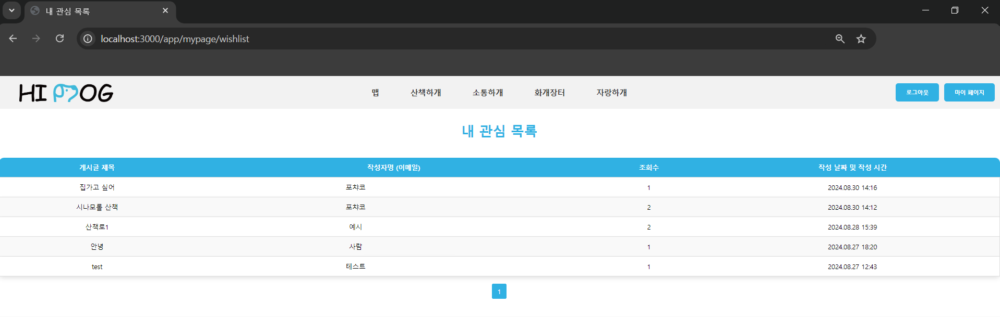
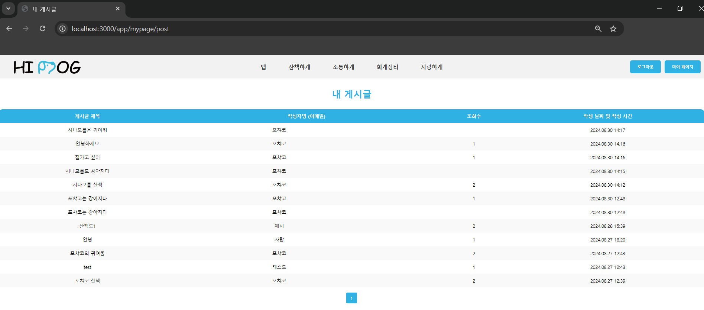

<h1>HI DOG PROJECT</h1>

<h2>프로젝트 소개</h2>

- 프로젝트 링크 : http://hidog.xyz/app
--------------------------------------------------------

* 강아지 커뮤니티

<h2>프로젝트 개발 기간</h2>

---------------------------------------------------------

* 2024.08.01 ~ 2024.09.01

<h2>프로젝트 팀 구성</h2>

--------------------------------------------------------

<table class="member">
    <thead>
        <tr>
            <th>멤버</th>
            <th>이름</th>
            <th>역할</th>
        </tr>
    </thead>
    <tbody>
        <tr>
            <td>조장</td>
            <td>김정훈</td>
            <td>관리자 페이지
                 
                결제 API 기능 구현
                 
                관리자 페이지 CSS
                 
                마켓 페이지 CSS
            </td>
        </tr>
        <tr>
            <td>조원</td>
            <td>김정현</td>
            <td>지도 페이지
                 
                지도 API 기능 구현
                 
                지도 페이지 CSS
            </td>
        </tr>
        <tr>
            <td>조원</td>
            <td>김선규</td>
            <td> 회원가입 & 로그인 페이지
                 
                회원가입 & 로그인 기능 구현
                 
               이메일 인증 기능 구현
                 
                회원가입 & 로그인 페이지 CSS
            </td>
        </tr>
        <tr>
            <td>조원</td>
            <td>박세현</td>
            <td>게시글 페이지
                 
                게시판 및 게시글 작성, 수정, 삭제 기능 구현
                 
                파일 업로드 기능 구현
                 
                게시판 & 게시글 페이지 CSS
            </td>
        </tr>
        <tr>
            <td>조원</td>
            <td>정채윤</td>
            <td>메인 페이지 & 마이 페이지
                 
                프로필 이미지 업로드 기능 구현
                 
                회원 정보 수정 기능 구현
                 
                관심 목록 및 내가 작성한 게시글 보기 기능 구현
                 
                메인 페이지 & 마이 페이지 CSS
            </td>
        </tr>
    </tbody>
</table>

<h2>개발 환경</h2>

-------------------------------------------------------------
<table class="tool">
    <thead>
        <tr>
            <th>영역</th>
            <th>도구</th>
        </tr>
    </thead>
    <tbody>
        <tr>
            <td>Front</td>
            <td>IntelliJ IDEA</td>
        </tr>
        <tr>
            <td>Back</td>
            <td>IntelliJ IDEA
                 
                SpringBoot
                 
                Oracle DataBase
            </td>
        </tr>
    </tbody>
</table>

<h2>유스케이스</h2>

---------------------------------------------------------

<h2>주요 기능</h2>

--------------------------------------------------------

1. 메인 페이지

 

2. 회원가입 페이지

3. 로그인 페이지

4. 마이 페이지

+ 마이 페이지 : 로그인 시 마이 페이지 버튼이 나타나는데, 버튼을 클릭하면 마이 페이지 화면으로 이동합니다.
 
 
+ 마이 페이지 홈은 회원 정보 수정 페이지에서 설정한 프로필 이미지가 원 형태로 보입니다.
 
 
+ 프로필 이미지 아래에는 회원 정보 수정 페이지로 이동하는 "회원 정보" 버튼, 찜하기 한 관심 목록 페이지로 이동하는 "관심 목록 보기" 버튼, 내가 작성한 게시글을 볼 수 있는 "내 게시글 보기" 버튼, 내가 구매한 내역을 볼 수 있는 "내 상점" 버튼이 있습니다.
 

(1) 회원정보 수정 페이지

+ 회원 정보 수정 페이지 : 회원가입 시 입력한 개인 정보를 "회원 정보 수정 페이지" 에서 수정할 수 있습니다. 
  (프로필 이미지, 닉네임, 비밀번호, 비밀번호 확인, 주소)

(2) 내 관심 목록 페이지

+ 내 관심 목록 페이지 : 작성한 게시글 중 찜 버튼을 누른 모든 게시판의 게시글이 작성 날짜 및 작성 시간 순으로 목록화되어 나옵니다.
  (소통하개, 자랑하개, 산책하개, 화개장터)

(3) 내 게시글 페이지

+ 내 게시글 페이지 : 로그인한 계정으로 작성한 모든 게시판의 게시글이 작성 날짜 및 작성 시간 순으로 목록화되어 나옵니다.
  (내 관심 목록 페이지와 동일)

5. 게시판 페이지

(1) 소통하개

(2) 자랑하개

(3) 산책하개

(4) 화개장터

6. 지도 페이지

7. 관리자 페이지